# 🧬 AI Test Case Generator (Local LLM)

A premium, localized QA Chatbot that generates **Manual Test Cases** and **Automation Scripts** using **Ollama (Llama 3.2)**. Built with a Glassmorphic UI and a robust FastAPI backend.

## 📐 Architecture

This project follows the **BLAST Protocol** and a **3-Layer Architecture** (Frontend, Backend, Logic).

```mermaid
graph TD
    User["👤 User"] -->|Types Request| UI["💻 Frontend (Glassmorphism)"]
    UI -->|POST /chat| API["🚀 Backend API (FastAPI)"]
    API -->|Process Request| Logic["🧠 Chatbot Logic"]
    Logic -->|Generate Response| DB[("🦙 Ollama Local LLM")]
    DB -->|Llama 3.2 Output| Logic
    Logic -->|Format Response| API
    API -->|JSON Response| UI
    UI -->|Render Markdown| User
```



## ✨ Features

-   **🔒 100% Local**: Runs entirely on your machine using Ollama. No data leaves your system.
-   **💬 QA Chatbot**: Acts as a senior QA Consultant.
-   **📋 Dual Mode**:
    -   **Proper Test Cases**: Tabular format with Pre-conditions, Steps, and Expected Results.
    -   **Automation Code**: Generates Python (`unittest`/`pytest`) or JS (`jest`) scripts on demand.
-   **🎨 Premium UI**: Glassmorphism design with dark mode and neon accents.

## 🚀 Getting Started

### Prerequisites

1.  **Python 3.10+** installed.
2.  **Ollama** installed and running. ([Download Ollama](https://ollama.com))

### 1. Setup Ollama

Pull the required model (Llama 3.2 is recommended for speed/quality balance):

```bash
ollama pull llama3.2
```

### 2. Installation

Clone the repository and install dependencies:

```bash
git clone https://github.com/shivamnamdev/Test-Case-Generator-using-Ollama.git
cd Test-Case-Generator-using-Ollama
pip install -r requirements.txt
```

### 3. Run the Application

Start the Backend Server:

```bash
uvicorn backend.main:app --reload
```

The server will start at `http://127.0.0.1:8000`.

### 4. Open the Interface

Simply open the `frontend/index.html` file in your browser.

```bash
# MacOS/Linux
open frontend/index.html

# Windows
start frontend/index.html
```

## 🛠️ Tech Stack

-   **Frontend**: HTML5, CSS3 (Glassmorphism), Vanilla JS
-   **Backend**: Python, FastAPI
-   **AI Engine**: Ollama (Llama 3.2)
-   **Protocol**: BLAST (Blueprint, Link, Architect, Stylize, Trigger)

## 📄 License

This project is open-source. Feel free to fork and contribute!
